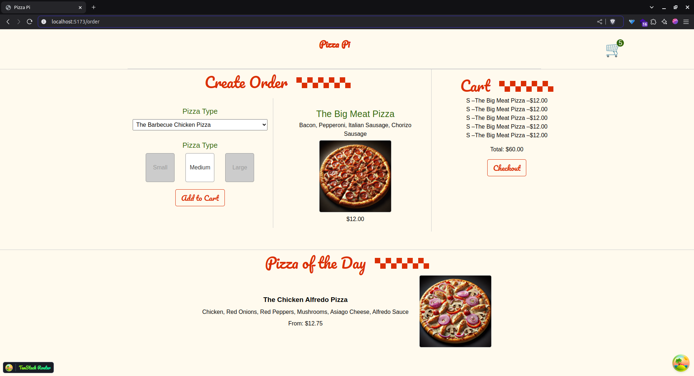

# Pizza Pi Project

Pizza Pi is a full-stack app built with the following technologies:

- Frontend: React, TanStack Router, TanStack Query, Context
- Backend: Node.js, Hono

## Setup

### Run the backend

1. Change directory to `api`: `cd api`
2. Install dependencies: `npm i`
3. Run the backend: `npm run dev`

### Run the UI

1. Install dependencies: `npm i`
2. Run the UI: `npm run dev`

## Screenshot

